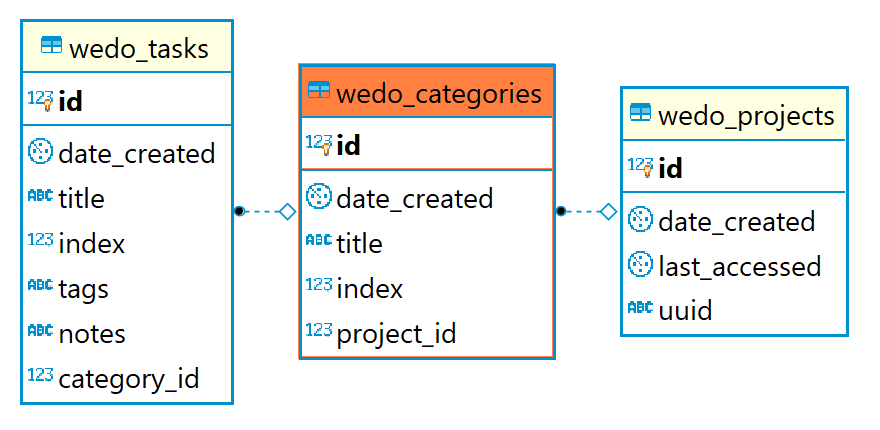

## Todo Together

A collaborative kanban board supporting user concurrency, implemented with React on the front end and Node.js on the back end.

[Demo](https://we-do.now.sh/)

[Frontend Documentation](https://github.com/pmnord/todo-management-react-capstone-client)

| | | | | |
|-|-|-|-|-|
|**Front-End**|React|ES10|CSS3||
|**Back-End**|Node.js|Express|PostgreSQL|RESTful API|
|**Development**|Jest|Mocha|Chai|Heroku|Zeit|
| | | | | |

## Endpoints

**Authorization:** All API calls require a valid API key set in the request header as `api-key`

---
### Project Endpoints

#### POST /api/project/

Generates a new Project and associated uuid.

**Constraints**
None

**Response**
`201 CREATED`
```js
{
    uuid: 'string'
}
```

#### GET /api/project/:uuid

Returns a project object with categories and tasks arrays. The full project object is ready to be loaded into the client application state after a single API call.

**Constraints**
None

**Response**
`200 OK`

```js
{
    id: 'number',
    date_created: 'string',
    last_accessed: 'string',
    uuid: 'string',
    categories: [
        {
            id: 'number',
            index: 'number',
            title: 'string',
            tasks: [
                {
                    id: 'number',
                    index: 'number',
                    title: 'string',
                    tags: 'string'
                }
            ]
        }
    ]
}
```

---
### Category Endpoints

#### POST /api/category/

**Constraints**
```js
{
    title: 'string',
    index: 'number',
    project_id: 'number'
}
```

**Response**
`201 CREATED` and returns the newly created category from the database

```js
{
    id: 'number',
    project_id: 'number'
    date_created: 'string',
    title: 'string',
    index: 'number',
}
```

#### PATCH /api/category/:category_id
The API does not support re-ordering categories. Only the title may be changed.

**Constraints**
```js
{
    title: 'string',
}
```

**Response**
`204 NO CONTENT`


#### DELETE /api/category/:category_id


**Constraints**
Delete requests require an array of category_id to be re-indexed.
(There may be a case for moving this work to the server)

```js
{
    toReIndex: [ category_id... ]
}
```

**Response**
`204 NO CONTENT`

---
### Task Endpoints

#### POST /api/task/

**Constraints**
```js
{
    title: 'string',
    index: 'number',
    category_id: 'number'
}
```

**Response**
`201 CREATED` and returns the newly created task from the database
```js
{
    id: 'number',
    category_id: 'number'
    date_created: 'string',
    title: 'string',
    index: 'number',
    tags: 'string',
    notes: 'string',
}
```

#### PATCH /api/task/:task_id

**Constraints**
`swapee` is a task id that must be included if the client is moving a task up or down within a category. The swapee will have its index in the database swapped with the task that is being updated.

```js
{
    title: 'string',
    index: 'number',
    tags: 'string',
    notes: 'string',
    category_id: 'number',
    swapee: 'number'
}
```

**Response**
`204 NO CONTENT`

#### DELETE /api/task/:task_id

**Constraints**
As with deleting categories, delete requests must include an array of task ids to be re-indexed.
(There may be a case for moving this work to the server)

```js
{
    toReIndex: [ task_id... ]
}
```

**Response**
`204 NO CONTENT`

---
## Entity Relationships (PostgreSQL tables)



## Development Roadmap

[See Frontend Documentation](https://github.com/pmnord/todo-management-react-capstone-client#user-content-developer-roadmap)
